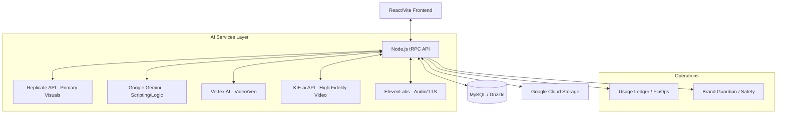
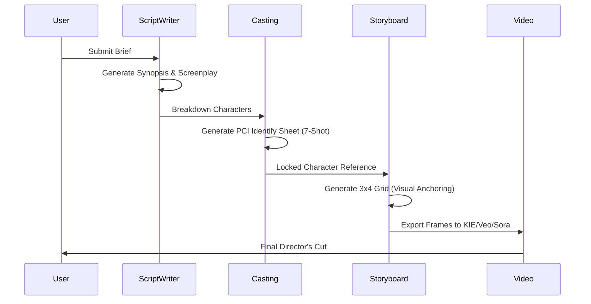

# 🎬 AI Film Studio: Technical Architecture & Pipeline Overview

**Version:** 2.1 (KIE Video Integration Edition)  
**Target Audience:** Technical Stakeholders & Developers  
**Core Mission:** Automating the cinematic production lifecycle through multi-provider agentic AI and visual anchoring.

---

## I. High-Level System Architecture

AI Film Studio is built on a modern, type-safe distributed architecture designed for high-concurrency generative tasks and cinematic consistency.

### 🏗️ Infrastructure Diagram

### 💻 The Tech Stack
- **Frontend:** React + Vite + TailwindCSS + Radix UI.
- **Backend:** Node.js + Express.
- **API Layer:** tRPC (End-to-end Type Safety).
- **ORM:** Drizzle (Declarative Schema, strict MySQL migrations).
- **Hosting:** Google Cloud Run (Containerized Scaling).
- **Identity:** Manus OAuth (OpenID Connect).

---

## II. The Creative AI Pipeline

The system follows a tiered "Director-First" workflow, where each phase feeds structured data into the **Project Bible** (a centralized JSON state storing the film's entire identity).

### 🎞️ Production Flow

### 1. Narrative Tier (Gemini)
- Translates high-level briefs into industry-standard formatted screenplays.
- Performs "Breakdown Analysis" to identify characters, sets, and props automatically.

### 2. Visual Identity (PCI Standard)
- **Photorealistic Character Identity (PCI):** Generates a mandatory 7-shot contact sheet (4 full-body, 3 close-up) for every character.
- **Visual Anchoring:** Uses these images as "Source Anchors" for all subsequent shot generation to ensure 100% character consistency.

### 3. Storyboard Synthesis (Replicate)
- **Engine:** `google/nano-banana-pro` (optimized for cinematic IMAX-style formats).
- **Method:** Img2Img anchoring. The system passes character references and set designs into the sampler to maintain consistency across different camera angles.

### 4. High-Fidelity Video Synthesis (KIE/Vertex)
- **Engines:** **Seedance 2.0**, **Kling 3.0**, and **Wan 2.6** (provided via KIE.ai Marketplace).
- **Multi-Provider Strategy:** A Factory Pattern allows the Director to hot-swap between video engines based on narrative needs (e.g., Luma for motion, Kling for person consistency), all while maintaining the same anchor image.

---

## III. Backend & Data Architecture

### 🗄️ Database Strategy
We use a **Schema-First** approach with Drizzle ORM.
- **Projects Table:** Stores core metadata and the `bible` (JSON).
- **ProjectContent Table:** Persists refined narrative versions (Synopsis, Script, Technical Shots).
- **StoryboardImages:** Tracks every iteration of every shot, including seeds and anchoring metadata.
- **Actors/LoRA:** Manages training state for custom AI actors.

### 📡 API Design (tRPC)
Instead of REST, we use tRPC to share TypeScript interfaces between client and server.
- **type-safety:** A rename of a database column in Drizzle causes a compile-time error in the React UI.
- **Routers:** Modularized into `projectRouter`, `aiRouter`, `castingRouter`, etc.

---

## IV. Governance & Financial Control

Built-in "FinOps" ensures that the studio remains profitable and content remains safe.

### 💰 Usage Ledger
- Every API call to Replicate, Gemini, or ElevenLabs is intercepted and logged.
- **Budget Guards:** If a generation is estimated to cost > $0.01, the UI forces an explicit user approval gate.
- **Tiering:** Supports "Fast" and "Quality" tiers to balance speed vs cost.

### 🛡️ Brand Guardian
- **Safety Filtering:** All prompts and outputs are sanitized via the Brand Guardian service.
- **Aesthetic Enforcement:** Ensures the visual style matches the brand's aesthetic (e.g., Noir, Corporate, High-Action).

---

## V. Deployment & Operations

### 🧪 CI/CD Pipeline
1. **GitHub Trigger:** Push to `main` triggers Google Cloud Build.
2. **Containerization:** Built into a Docker image (GCR).
3. **Deployment:** Automated migration to Cloud Run with secondary secret injection.

## 5. Security & Stability
- **GCP Secret Manager**: Zero hardcoded keys. Production environment variables are injected via a secure pipeline.
- **FinOps Controller**: Any generation costing > $0.01 triggers an explicit manual approval probe in the UI.
- **Auto-Scaling**: Configured for 10-20 concurrent instances on Google Cloud Run to ensure zero-latency response during peak high-fidelity rendering loads.
- **Asset Ownership**: Mandated pipeline: `Generate -> Download -> Secured GCS -> DB Link`.
- Assets are never hosted on temporary third-party links (Replicate/Gemini URLs). They are migrated to a dedicated **Private GCS Bucket** within milliseconds of generation.

---

**Summary:** AI Film Studio is not just an image generator; it is a **Project Orchestrator** that bridges the gap between creative vision and technical execution through strict visual anchoring and agentic governance.
